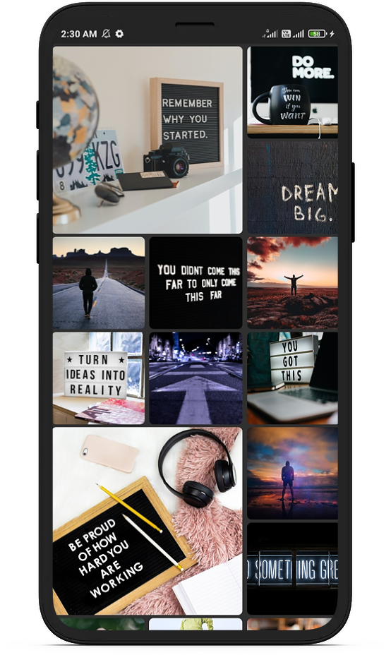

  

<h1 align="center">Welcome to Wallify 👋</h1>

 
  
 
  
  
 
  
 
 

## Download , Set and Share 10000+ HD Wallpapers for completely free!!!
Our goal is to serve amazing Wallpapers to the people all across the world. Bring your screen to life with exclusive Wallpapers delivered to you by Wallify
Did you know that an average user checks their device more than 100 times a day? Make each time a real pleasure with unique wallpapers from QHD Wallpapers collections. Let your device become a source of self-expression, joy, inspiration and beautiful!

## 200+ Downloads

## Concepts used:
* Wallpapers from [Unsplash](https://unsplash.com/) and [Pexels](https://www.pexels.com/)
* Dynamic Theming
* Set Wallpapers using Wallpaper Manager
* Navigation Using Carousel slider and BottomNavigationBar
* Share Wallpaper using Share Package

## Features
* High-Quality Wallpapers from [Unsplash](https://unsplash.com/) and [Pexels](https://www.pexels.com/)
* Instagram like UI Grid
* Explore through different categories
* Apply to both Homescreen and LockScreen
* Seamless user experience
* Download the ones you like
* Sharing Wallpapers 
* Dark mode support

## Demo
<table style={border:"none"}><tr>
  <tr>
    <td></td>
    <td></td>
     <td></td>  
  </tr>
  </table>
  
##  Requirements
- Android 7.0 and Above
- Min sdk version 24

##  Permissions
- INTERNET
- NETWORK_STATE
- SET WALLPAPER
- EXTERNAL STORAGE
 
# Contribution Guidelines

## Requirements
* Any Operating System (ie. MacOS X, Linux, Windows)
* Any IDE with Flutter SDK installed (ie. IntelliJ, Android Studio, VSCode etc)
* A little knowledge of Dart and Flutter

Please feel free to file issues at [Wallify issues](https://github.com/SAMYAK99/Wallify/issues). Flutter issues can be filed at [Flutter issues](https://github.com/flutter/flutter/issues).

You can also contribute changes. Setting up:
1. Fork `https://github.com/SAMYAK99/Wallify.git` into your own GitHub account
2. `git clone https://github.com/<your_name_here>/Wallify.git`
3. `cd Wallify.git`
4. `git remote add upstream https://github.com/<your_name_here>/Wallify.git`

Submitting changes:
1. `git fetch upstream`
2. `git checkout upstream/master -b name_of_your_branch`
3. Make changes
4. `git commit -a -m "<your informative commit message>"`
5. `git push origin name_of_your_branch`

To send a pull request:
1. `git pull-request` (if you are using [Hub](https://hub.github.com/)) or go to [Wallify](https://github.com/SAMYAK99/Wallify) and click the "Compare & pull request" button
2. Tag the relevant people and GitHub issue (if any)
